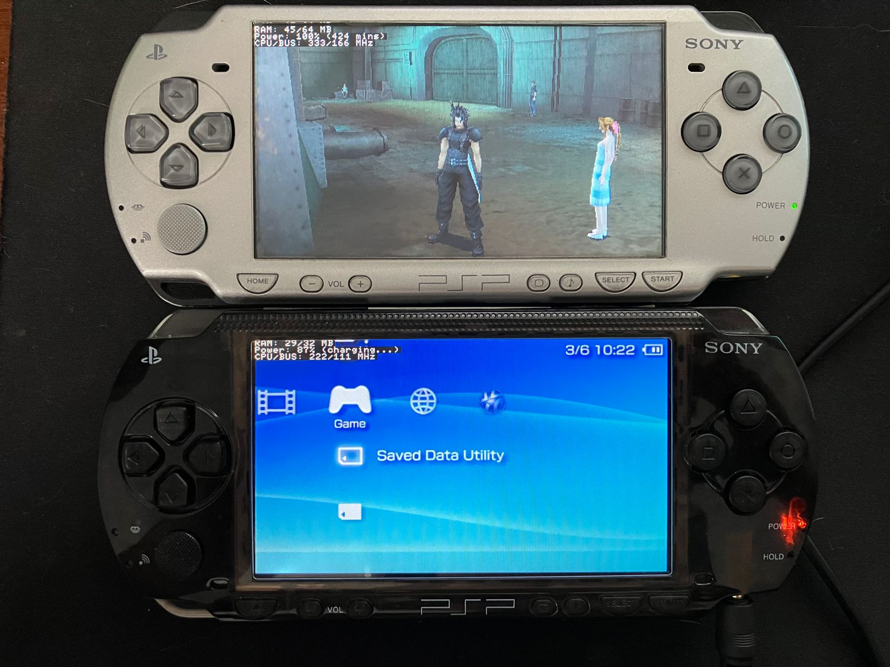

# missyhud.prx
Long time ago, when I was a little kid, I used to play a lot of games on my
PSP. In my time at the university I abandoned it in my office drawer. Years later, as part of the Glorious PC Gaming Master Race,
a HUD is something always necessary for me.
Not long ago, my PSP was reborn from the ashes, and I haven't found a plugin
that meets my metric needs. Here it is.

**missyhud.prx** is a plugin to display a simple HUD.



## Features
> [!NOTE]
> Unmarked are W.I.P features.

- [x] Stupidly simple black UI (yes, the best one)
    - [ ] UI customization
    - [ ] Color customization
- [x] Compatible with VSH, GAME and POPS
- [x] RAM usage indicator
- [x] Power percentage indicator
    - [x] Duration minutes
    - [x] Charging detection
    - [x] No battery detection
- [x] CPU/BUS clock speeds indicator
- [x] FPS indicator
    - [ ] Support for double buffering games (i.e. GTA: LCS)
    - [ ] Support for POPS (PSX eboots)
- [x] Key combination to turn on and off (Hold L + R + Start for 1 second)

## Installation
1. Download the [latest release](https://github.com/pebeto/missyhud.prx/releases/latest) `missyhud.prx` from Assets
2. Copy `missyhud.prx` to
    - `ms0:/seplugins/` for PSP 1000, 2000, 3000 and Street
    - `ef0:/seplugins/` for PSP Go
3. Add the plugin to your VSH, GAME and/or POPS environments
	- `SEPLUGINS.TXT` in ARK systems
		- PSP 1000, 2000, 3000 and Street
        ```
        game, ms0:/seplugins/missyhud.prx, on
        vsh, ms0:/seplugins/missyhud.prx, on
        pops, ms0:/seplugins/missyhud.prx, on
        ```
		- PSP Go
        ```
        game, ef0:/seplugins/missyhud.prx, on
        vsh, ef0:/seplugins/missyhud.prx, on
        pops, ef0:/seplugins/missyhud.prx, on
        ```
	- `game.txt`, `vsh.txt` and/or `pops.txt` in Non-ARK systems
		- PSP 1000, 2000, 3000 and Street
        ```
        ms0:/seplugins/missyhud.prx 1
        ```
		- PSP Go
        ```
        ef0:/seplugins/missyhud.prx 1
        ```
4. Restart your device and enjoy your HUD!

## Usage
Once the plugin is activated, the HUD will automatically appear in the left corner of the screen. To hide it, hold `L + R + Start` for 1 second. To show it again, repeat the same.

## Known issues and doubts
- According to the **PSPSDK** documentation, `sceKernelTotalFreeMemSize` returns a different value than `pspSdkTotalFreeUserMemSize`
- The FPS indicator does not work with double buffering. Follow-up on [this issue](https://github.com/pebeto/missyhud.prx/issues/3) is ongoing.

## Why missy?
Missy is the name of my cat.
