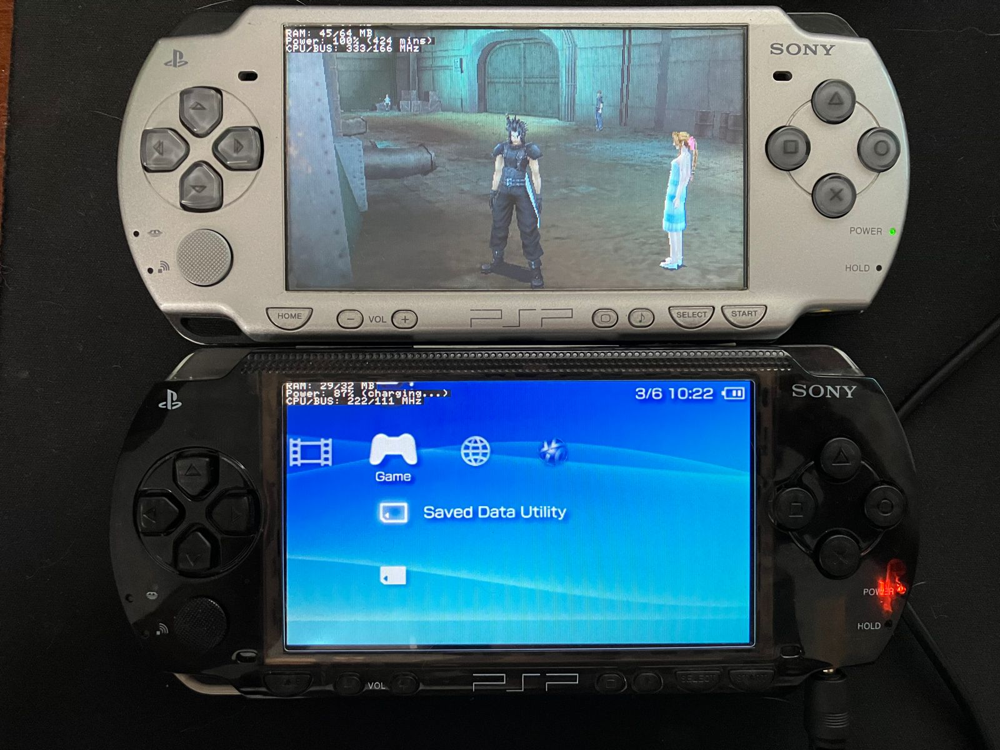

# missyhud.prx
Long time ago, when I was a little kid, I used to play a lot of games on my
PSP. In my time at the university I abandoned it in my office drawer. Years later, as part of the Glorious PC Gaming Master Race,
a HUD is something always necessary for me.
Not long ago, my PSP was reborn from the ashes, and I haven't found a plugin
that meets my metric needs. Here it is.

**missyhud.prx** is a plugin to display a simple HUD.



## Features
> [!NOTE]
> Unmarked are W.I.P features.

- [x] Stupidly simple black UI (yes, the best one)
    - [x] Cycle position (START + Analog left/right)
    - [x] UI customization (pinned position, per-indicator toggles)
    - [x] Color customization
- [x] Compatible with VSH, GAME and POPS
- [x] RAM usage indicator
- [x] Power percentage indicator
    - [x] Duration minutes
    - [x] Charging detection
    - [x] No battery detection
- [x] CPU indicators
    - [x] CPU Usage
    - [x] CPU clock speed
    - [x] BUS clock speed
- [x] FPS indicator
    - [x] Exact count from buffer flips
    - [x] Estimate from GE display lists for games that never flip (i.e. GTA: LCS)
    - [ ] Support for POPS (PSX eboots)
- [x] Key combination to turn on and off (Hold L + R + Start for 1 second)

## Installation
1. Download the [latest release](https://github.com/pebeto/missyhud.prx/releases/latest) `missyhud.prx` from Assets
2. Copy `missyhud.prx` to
    - `ms0:/seplugins/` for PSP 1000, 2000, 3000 and Street
    - `ef0:/seplugins/` for PSP Go
3. Add the plugin to your VSH, GAME and/or POPS environments
	- `SEPLUGINS.TXT` in ARK systems
		- PSP 1000, 2000, 3000 and Street
        ```
        game, ms0:/seplugins/missyhud.prx, on
        vsh, ms0:/seplugins/missyhud.prx, on
        pops, ms0:/seplugins/missyhud.prx, on
        ```
		- PSP Go
        ```
        game, ef0:/seplugins/missyhud.prx, on
        vsh, ef0:/seplugins/missyhud.prx, on
        pops, ef0:/seplugins/missyhud.prx, on
        ```
	- `game.txt`, `vsh.txt` and/or `pops.txt` in Non-ARK systems
		- PSP 1000, 2000, 3000 and Street
        ```
        ms0:/seplugins/missyhud.prx 1
        ```
		- PSP Go
        ```
        ef0:/seplugins/missyhud.prx 1
        ```
4. Restart your device and enjoy your HUD!

## Configuration
Everything works without a config file. To change something, copy
[`missyhud.config.sample`](./missyhud.config.sample) to
`ms0:/seplugins/missyhud.config`, or `ef0:/seplugins/` on a PSP Go, and edit it.

```
FG_COLOR=0xFFFFFF
BG_COLOR=0x000000
CPU_INDICATORS=1
POWER_INDICATORS=1
RAM_INDICATORS=1
FPS_INDICATOR=1
#POS_X=0
#POS_Y=0
```

Colours are `0xRRGGBB`. Setting an indicator to `0` hides it and the rows below
close up. `POS_X` and `POS_Y` are character cells, 7 pixels across and 8 down;
setting either pins the HUD there and turns off cycling with `START + Analog`.

Every line is optional, and a line that cannot be read is skipped rather than
discarding the rest of the file. The config is read about a second after boot,
because the memory stick is not mounted before that.

## Usage
Once the plugin is activated, the HUD will automatically appear in the left corner of the screen. To hide it, hold `L + R + Start` for 1 second. To show it again, repeat the same.

The FPS indicator says where its number came from:
- `FPS: 60`, counted from buffer flips, which is one call per frame
- `FPS: 30 (ge)`, estimated from GE display list submissions
- `FPS: n/a (find)`, the system does not export what the hooks need

## Known issues and doubts
- According to the **PSPSDK** documentation, `sceKernelTotalFreeMemSize` returns a different value than `pspSdkTotalFreeUserMemSize`
- Some games never change the scanout address, so there are no buffer flips to count. GTA: LCS is one of them. The FPS then comes from counting GE display list submissions and marks itself `(ge)`. Most engines submit one list per frame, so the two usually agree, but a game that renders in several passes per frame reads high. Follow-up on [this issue](https://github.com/pebeto/missyhud.prx/issues/3) is ongoing.
- In those same games the HUD is drawn into the buffer already on screen rather than the one about to be flipped, so it can flicker.

## Why missy?
Missy is the name of my cat.
