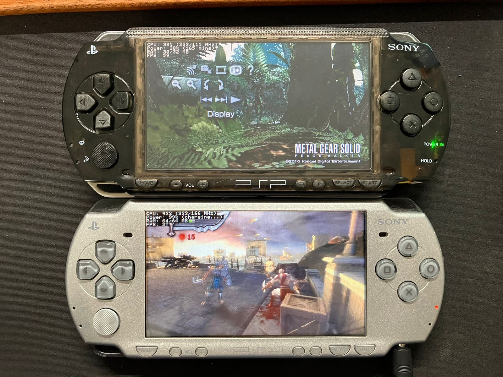

# missyhud.prx
Long time ago, when I was a little kid, I used to play a lot of games on my
PSP. In my time at the university I abandoned it in my office drawer. Years later, as part of the Glorious PC Gaming Master Race,
a HUD is something always necessary for me.
Not long ago, my PSP was reborn from the ashes, and I haven't found a plugin
that meets my metric needs. Here it is.

**missyhud.prx** is a plugin to display a simple HUD.

## Features
> [!NOTE]
> Unmarked are W.I.P features.

- [x] Stupidly simple black UI (yes, the best one)
    - [ ] Color customization
- [x] Compatible with VSH, GAME and POPS
- [x] RAM usage indicator
- [x] Power percentage indicator (with duration minutes and charging detection)
- [x] CPU/BUS clock speeds indicator
- [ ] FPS indicator
- [ ] Key combination to turn on and off

## Installation
TODO

## Known issues and doubts
- According to the **PSPSDK** documentation, `sceKernelTotalFreeMemSize` returns a different value than `pspSdkTotalFreeUserMemSize`.

## Why missy?
Missy is the name of my cat.
